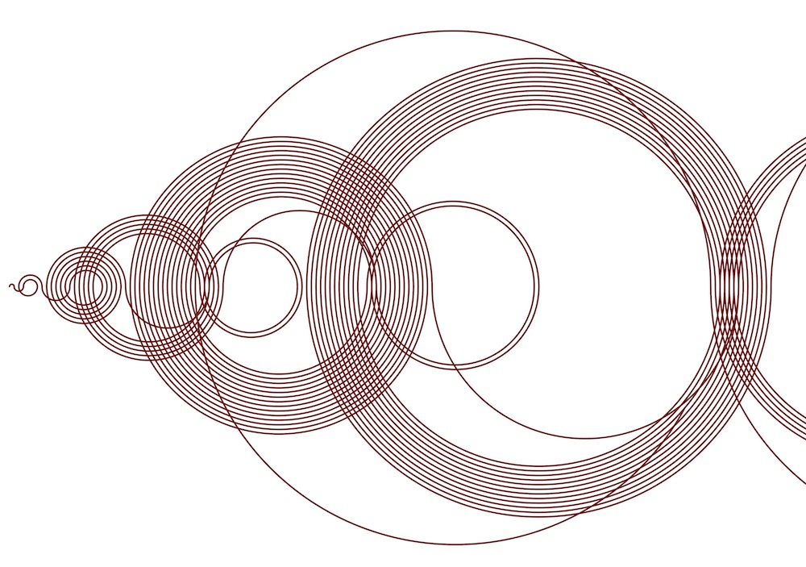
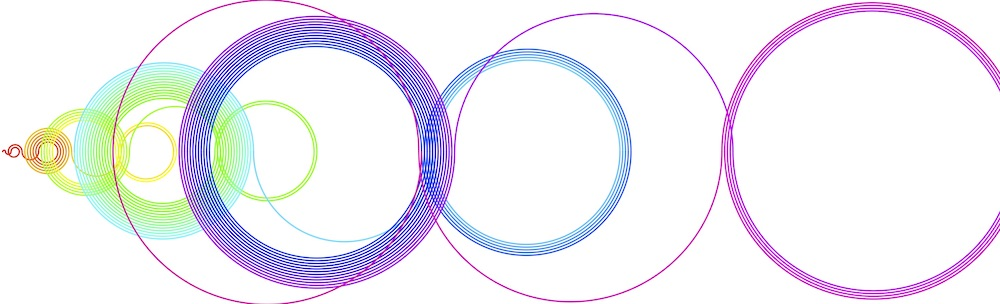

# convert_image_to_ascii.py

Recamán's sequence of numbers visualised or calculated

## recaman_sequence_visualised.py
\
\

## recaman_sequence.py
```bash
[0, 1, 3, 6, 2, 7, 13, 20, 12, 21, 11, 22, 10, 23, 9, 24, 8, 25, 43, 62, 42, 63, 41, 18, 42, 17, 43, 16, 44, 15, 45, 14, 46, 79, 113, 78, 114, 77, 39, 78, 38, 79, 37, 80, 36, 81, 35, 82, 34, 83, 33, 84, 32,
```

## What?

Calculate and display the Recamáns sequence (http://oeis.org/A005132). \
Visualisation options include colour, size, line width, and quality (smoothness of circles). \
Output to file or screen
## recaman_sequence_visualised.py

```bash
usage: recaman_sequence_visualised.py [-h] [-o PATH] [-l INTEGER | -m INTEGER] [-s SCALE] [-w INTEGER] [-q QUALITY] [-e SHAPE] [-b DECIMAL DECIMAL DECIMAL]
                                      [-f DECIMAL DECIMAL DECIMAL] [-r] [-x WIDTH] [-y HEIGHT]

Recamáns sequence of numbers visualised with turtle

optional arguments:
    -h, --help
            show this help message and exit
    -o PATH, --out-file PATH
            Export to file instead, postscript (.ps)
            Default: None
    -l INTEGER, --length INTEGER
            The amount of numbers to calculate
            Default: 112
    -m INTEGER, --max-length INTEGER
            Calculate up to, and stop, after number is reached
    -s SCALE, --scale SCALE
            Scale of the visuals, 2 is double
            Default: 2
    -w INTEGER, --line_width INTEGER
            Scale of the visuals, 2 is double
            Default: 1
    -q QUALITY, --quality QUALITY
            Quality of the curves, 1 is base
            Default: 10
    -e SHAPE, --end SHAPE
            Symbol to appear at the end of the draw
            Default: None
    -b DECIMAL DECIMAL DECIMAL, --colour-back DECIMAL DECIMAL DECIMAL
            3 RGB values of 0.0-1.0Note: Does no apply to saved files, change in post
            Default: [1.0, 1.0, 1.0]
    -f DECIMAL DECIMAL DECIMAL, --colour-line DECIMAL DECIMAL DECIMAL
            3 RGB values of 0.0-1.0
            Default: [0.0, 0.0, 0.0]
    -r, --colour-rainbow
            Rainbow gradientNote: Overrides pen colour and works better with -length
            Default: False
    -x WIDTH, --width WIDTH
            Width of the window
            Default: 1024
    -y HEIGHT, --height HEIGHT
            Height of the window
            Default: 720
```

## Why?
I liked the visualisation and wanted to be able to create variants of it or print it.

## Improvements?
More options

## State?
No known bugs.  Works.
